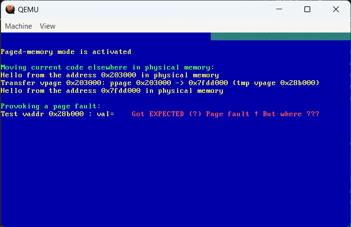

# Titre 

Ceci est mon premier billet 

## Sous-titre

Voici un paragraphe avec **du texte en gras** et *du texte en italique*.

- Point 1
- Point 2
- Point 3

## Exemple de code

```python
# -----------------------------------------------------------------------------
def on_produce(err: int, msg: Message) -> None:
    global g_Delivered_Records
    # Delivery report handler called on successful or failed delivery of message
    if err is not None:
        print(f"Failed to deliver message: {err}", flush=True)
    else:
        g_Delivered_Records += 1
        print(
            f"Produced record to topic {msg.topic()} partition [{msg.partition()}] @ offset {msg.offset()}", flush=True
        )

```

## Exemple de d'équation?
Dans une ligne $$E=mc^2$$ de texte.      
Dans une équation :    

$$ E = mc^2 $$


## Exemple d'image ?


Avec du texte



Avec du texte

<p align="center">

<p>


[Lien vers un autre site](https://example.com)
